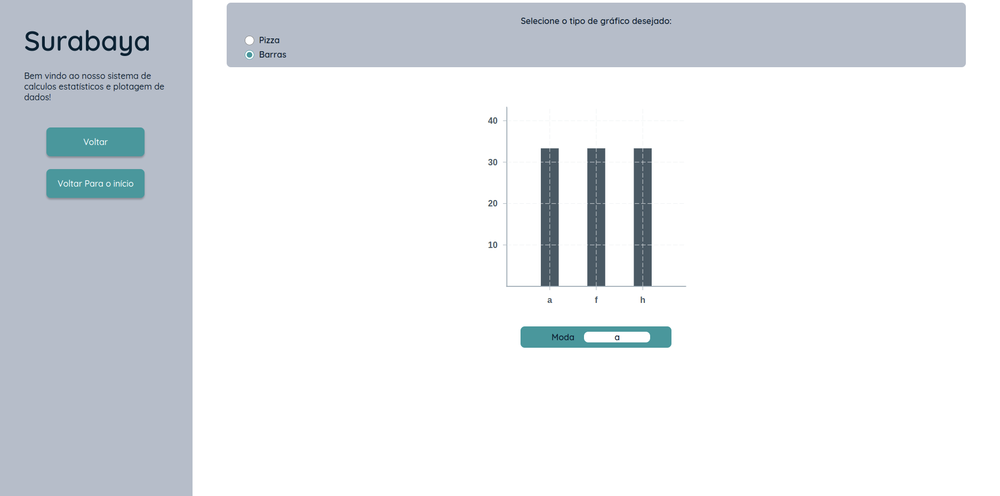

# Frontend

Nossa aplicação Frontend consome uma API que fará toda a parte lógica.

## Sobre as tecnologias utilizadas

Foi utilizado [React](https://react.dev/) junto com [Babel](https://babeljs.io/docs/babel-preset-react) com função de
transpiler e [WebPack](https://webpack.js.org/) com função de module bundler.

Utilizamos uma organização seguindo os padrões do Atomic Design para melhor reutilização dos componentes.

## Como Utilizar

Para que possa rodar a aplicação Frontend será necessário ter instalado o [Yarn](https://yarnpkg.com/).

Use este comando para instalar as dependências do projeto:

```shell
yarn install
```

Use este comando para dar início ao projeto:

```shell
yarn start
```

## Sobre as funcionalidades

- Página inicial
  
- Página de escolha de inserção de dados
  
  - Ao escolher o modo "Manual" é mostrado a tela onde o usuário pode escolher tanto inserir de forma manual os dados o
    levando para a página da tabela que será feita a inserção dos dados de forma manual.
    
  - Ao escolher o modo "Inserir Arquivo" é mostrado uma tela onde o usuário pode inserir o arquivo (`.csv`) e o enviar
    para a tabela
    
    
- Na página da tabela é possível fazer a edição de dados (mudar céculas da tabela, adicionar novas linhas ou colunas) e
  baixar um arquivo `.csv` que representa a tabela no estado atual que é mostrado na tela do usuário ao clicar no
  botão "Exportar".
  
- Para fazer o cálculo das medidas estatísticas é necessário escolher uma coluna da tabela e clicar no botão "Calcular"
  e será exibida a tela de análise, onde será possível selecionar o gráfico que melhor preferir visualizar (Sendo para
  análises qualidativas disponível Barras e Pizza; e para quantitativas disponível Barra, Pizza, Histograma e Box Plot).
  
  
  
  
- Ao final é possível voltar ao início e reiniciar uma nova análise.
